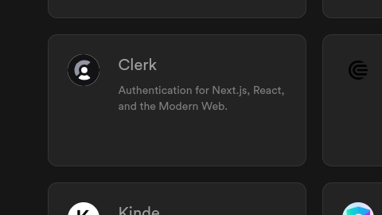

# Offensive Supabase | Weaponizing Self-Hosted Supabase Systems

## Integrations with external tools (not Supabase)
---

### API Platforms

#### [n8n](https://supabase.com/partners/integrations/n8n)
[n8n](https://supabase.com/partners/integrations/n8n) offers a `full-stack` `workflow` for `data automation` and `data integration` in `any language`.

#### [Stream](https://supabase.com/partners/integrations/getstream_io)
[Stream](https://supabase.com/partners/integrations/getstream_io) allows `developers` to *seamlessly* integrate `real-time messaging` or `activity feeds` into their `applications`. 
They provide high-fidelity `UI SDKs` for **all major platforms** and a **fully documented** `REST API` for *both* `services`.

### Authentication

#### Fuck it. We are going with Clerk for auth.

**Why?** => it says *it works with `React`* on the [Supabase](https://supabase.com) integrations page, and I want to use `React` for the UI so... yeah.

